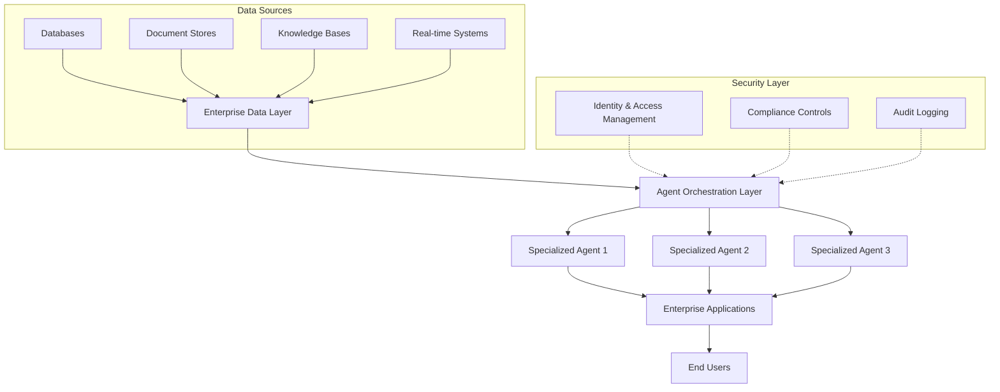
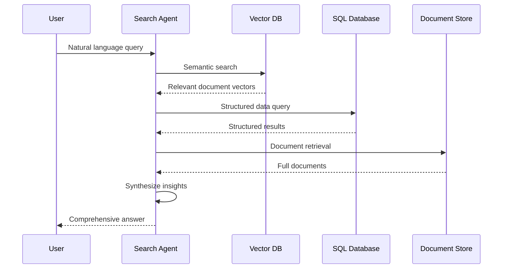
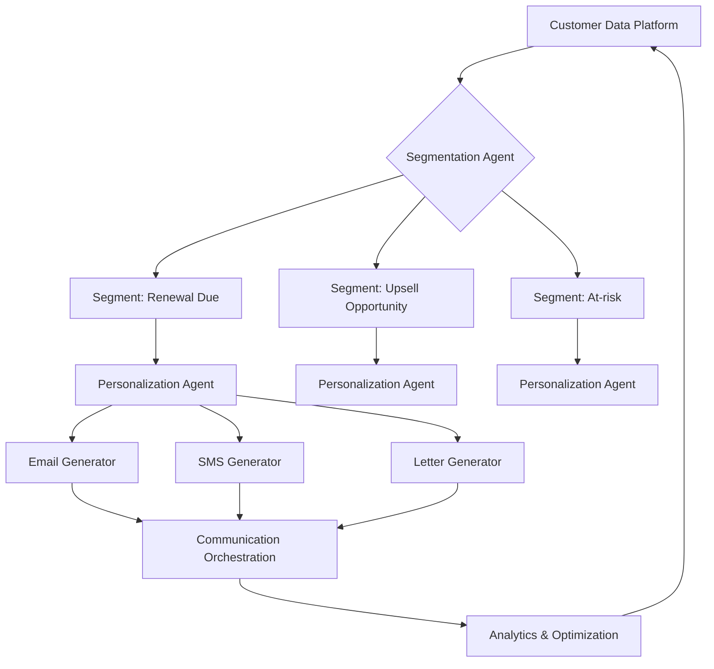
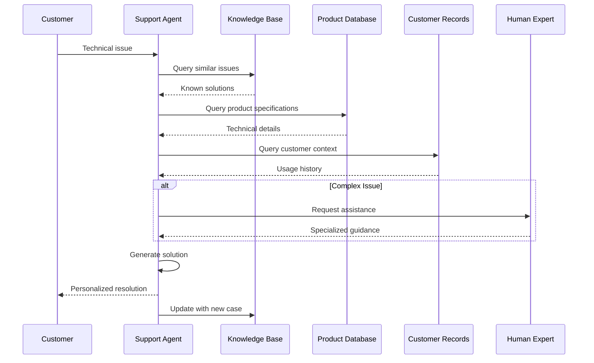
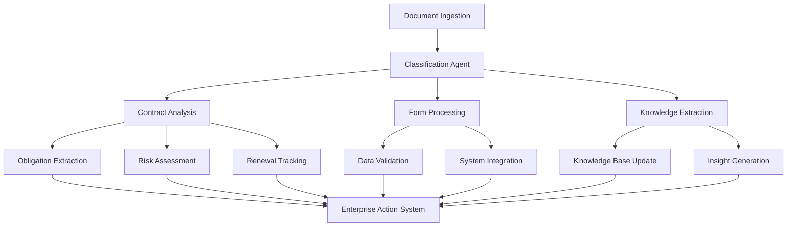

# Vertical AI Agents - Implementation Considerations

An exploration of implementation strategies for enterprise vertical AI agents...

## Architectural Framework Considerations

A robust architecture is essential for sustainable implementation:

Essential architectural components include:
- Centralized orchestration for agent coordination
- Comprehensive security implementation
- Seamless integration with existing enterprise systems
- Performance optimization to ensure responsiveness

## High-Potential Implementation Opportunities

### Advanced Enterprise Search and Retrieval

Information retrieval across disparate systems represents a significant opportunity:

Implementation considerations:
- Vector embeddings for semantic similarity matching
- Retrieval augmented generation for factual grounding
- Specialized indexing strategies for diverse content types
- Confidence scoring mechanisms for response validation

### Personalized Communication Orchestration

Sophisticated outbound communication systems offer significant engagement improvements:

Implementation considerations:
- CRM and customer data platform integration
- A/B testing infrastructure for continual optimization
- Feedback mechanisms for system refinement
- Human review workflows for critical communications
- Regulatory compliance frameworks (GDPR/CCPA)

### Advanced Technical Support Systems

Support resolution efficiency represents a substantial opportunity:

Implementation considerations:
- Knowledge graph integration for product and support case connectivity
- Fine-tuning methodologies utilizing historical support interactions
- Structured troubleshooting procedure development
- Sentiment analysis for customer satisfaction monitoring
- Escalation pathways for complex scenarios

### Intelligent Document Processing

Automated document analysis provides significant operational efficiencies:

Implementation considerations:
- Document-specific OCR and extraction methodologies
- Validation workflows for critical information
- Quality assurance procedures
- Confidence scoring frameworks for human review determination
- Machine learning from correction patterns

# Vertical AI Agents - Brain Dump

Alright, let's just get all these implementation ideas out there as we think about vertical AI agents for clients...

## The Big Picture: How We'd Stitch This Together

We need to think about a smart architecture that doesn't become a nightmare to maintain. Something like:

Basically we need:
- Something to orchestrate all these different specialized agents
- Rock-solid security (can't skimp here)
- Ways to plug into all their existing stuff
- Performance that doesn't make users want to throw their computers out the window

## Implementation Ideas Worth Exploring

### Multi-layer Search That Actually Works

People waste SO MUCH time looking for stuff across different systems. We could fix that:

Quick notes:
- Vector embeddings make semantic search actually work
- RAG (retrieval augmented generation) keeps answers grounded in facts
- Need specialized indexes for different content types
- Should include confidence scores so users know when to double-check things

### Outbound Comms That Don't Feel Robotic

Nobody likes getting generic emails. We could build something that actually feels personalized:

Things to keep in mind:
- Need to hook into their CRM and customer data
- Should A/B test everything to keep improving
- Build feedback loops so the system gets smarter
- Include human review for important/sensitive stuff
- Don't get them in hot water with GDPR/CCPA violations

### Support Agents That Actually Solve Problems

Support tickets are a huge time sink. Most chatbots are useless, but we could do better:

Key stuff:
- Need knowledge graphs connecting products and support cases
- Fine-tuning on past support convos makes a huge difference
- Build troubleshooting flows that actually make sense
- Add sentiment detection so it can tell when customers are about to lose it
- Always have escape hatches for weird edge cases

### Document Processing That Doesn't Suck

Nobody wants to manually extract data from piles of documents:

Important bits:
- Different document types need different OCR/extraction approaches
- Need validation workflows for critical info
- Quality checks are non-negotiable
- Confidence scoring helps decide when humans need to check things
- System should learn from corrections

## Implementation Challenges Nobody Talks About

**Data Silos Are Still a Nightmare**
- Most organizations still have data trapped in legacy systems
- Different departments often have conflicting data models
- Historical data quality is usually terrible
- Real-time data access is often a pipe dream

**Solution:** Start with a data diagnostic and begin with the cleanest, most accessible data sources. Build connectors that can handle messy data gracefully.

**The "Last Mile" Problem**
- Getting insights into actual workflows is harder than generating them
- Existing processes often resist change
- Legacy systems often can't be easily integrated with modern APIs
- User adoption requires more than just good technology

**Solution:** Focus on integrating with existing tools users already work with (email, Slack, CRM, etc.) rather than requiring new interfaces.

**The Trust Deficit**
- Users are skeptical of AI recommendations without explainability
- Compliance departments are terrified of AI-generated content
- Early failures can poison the well for future attempts
- Different stakeholders have different trust requirements

**Solution:** Build explainability from the ground up and implement graduated autonomy where AI earns trust over time with human verification.
